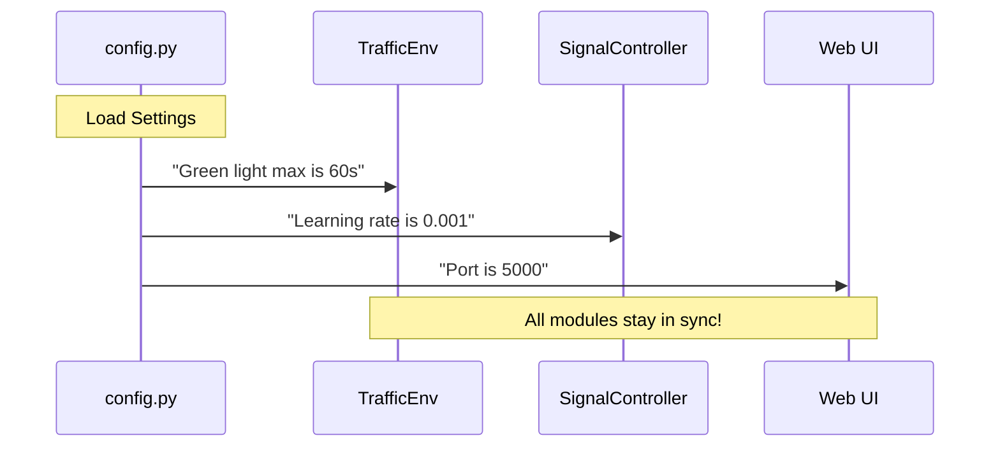

# Chapter 1: Centralized System Configuration (config.py)

Welcome to the first step of building your adaptive traffic signal system! Before we start teaching an AI how to manage traffic or building a "Green Corridor" for ambulances, we need a foundation.

### The Problem: The "Hardcoding" Nightmare
Imagine you are building a complex system with hundreds of files. In one file, you decide the yellow light should last **3 seconds**. Later, in another file that controls the Web UI, you also type **3 seconds**. 

A month later, the city council asks you to change it to **5 seconds**. You now have to hunt through every single file to find every "3" and change it to a "5." If you miss even one, the system breaks or displays the wrong information.

### The Solution: The "Control Panel"
The `config.py` file is the **DNA** or the **Control Panel** of our project. Instead of burying rules deep in the code, we put every important setting—from timing to AI sensitivity—in this one single file.

---

### Key Concepts of config.py

To keep things organized, our configuration is broken down into three main categories:

1.  **Paths:** Telling the computer exactly where to find AI models and data folders.
2.  **Timings:** Defining the rules of the road (how long is a green light?).
3.  **Thresholds:** Setting the "sensitivity" (how sure does the AI need to be before it identifies an ambulance?).

#### 1. Defining Paths
First, the system needs to know where it lives on your computer.

```python
from pathlib import Path

# Locate the folder where this file sits
PROJECT_ROOT = Path(__file__).resolve().parent

# Automatically create a folder for our AI models
MODELS_DIR = PROJECT_ROOT / "models"
MODELS_DIR.mkdir(exist_ok=True)
```
**What this does:** It uses the `pathlib` library to find the project folder and ensures a folder named `models` exists. This way, the "Brain" of our system always knows where to look for its memories.

#### 2. Setting the Rules of the Road
Next, we define the physical limits of our traffic lights.

```python
MIN_GREEN = 5      # Shortest a green light can be (seconds)
MAX_GREEN = 60     # Longest a green light can be (seconds)
YELLOW_DURATION = 3 # Fixed time for yellow lights
```
**What this does:** By defining these here, the [Traffic Simulation Environment (TrafficEnv)](02_traffic_simulation_environment__trafficenv__.md) and the [DQN Signal Optimizer (SignalController)](04_dqn_signal_optimizer__signalcontroller__.md) will both follow the exact same rules without us having to tell them twice.

#### 3. AI Sensitivity (Thresholds)
Our system uses cameras to see cars and microphones to hear sirens. But how "sure" should it be?

```python
# 0.5 means the AI must be 50% sure it sees a car
CONFIDENCE_THRESHOLD = 0.5 

# How often to check the camera (every 3 seconds)
INFERENCE_INTERVAL = 3.0 
```
**What this does:** This allows engineers to tune the system's performance. If the AI is missing cars, we can just lower this number in one place.

---

### How to use the Configuration
When you want to use these settings in another part of the project, you simply "import" them. 

For example, here is how our `main.py` uses the config to start the web server:

```python
# main.py
from config import FLASK_HOST, FLASK_PORT

def main():
    # Start the web interface using settings from config.py
    print(f"Starting server at {FLASK_HOST}:{FLASK_PORT}")
    # ... logic to start server ...
```
**Output:** The system looks at `config.py`, sees `FLASK_PORT` is `5000`, and starts the server there automatically.

---

### Under the Hood: How it Works

When the project starts, `config.py` is the very first thing loaded. It acts as a "Source of Truth."



#### Step-by-Step Logic:
1.  **Environment Check:** The script checks if you have any "Environment Variables" set (special computer settings).
2.  **Default Values:** If you haven't set any special variables, it uses safe defaults (like `30` seconds for a light).
3.  **Path Calculation:** It calculates the folders on your specific hard drive so the code works on any computer.
4.  **Distribution:** Every other module (like the [Model Orchestrator (ModelController)](03_model_orchestrator__modelcontroller__.md)) imports these constants.

---

### Summary
In this chapter, we learned that `config.py` is the "Rulebook" for our entire system. It ensures that the "Eyes" (Vision), "Brain" (AI), and "Web UI" are all speaking the same language.

**What we achieved:**
- Created a single place to change system behavior.
- Set up automatic folder management.
- Defined the boundaries for our AI and traffic rules.

In the next chapter, we will use these configurations to build the world our AI lives in: **[Chapter 2: Traffic Simulation Environment (TrafficEnv)](02_traffic_simulation_environment__trafficenv__.md)**.

---

Generated by [AI Codebase Knowledge Builder](https://github.com/The-Pocket/Tutorial-Codebase-Knowledge)