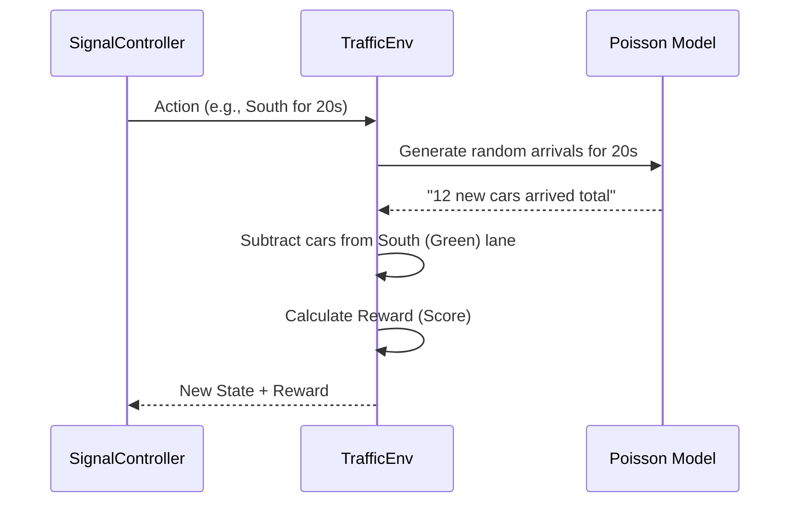

# Chapter 2: Traffic Simulation Environment (TrafficEnv)

In [Chapter 1: Centralized System Configuration (config.py)](01_centralized_system_configuration__config_py__.md), we built the "Rulebook" for our project. Now, it is time to build the world those rules live in.

### The Problem: You Can't Teach an AI on a Real Street
Imagine you are teaching a student how to fly a plane. You wouldn't put them in a real Boeing 747 with 300 passengers on their first day, right? They would likely crash. 

Training a Traffic AI on real streets is the same:
1.  **It's Dangerous:** A "trial and error" mistake could cause a real-life multi-car pileup.
2.  **It's Slow:** Waiting for real cars to arrive at 3:00 AM takes forever. The AI needs millions of experiences to learn.

### The Solution: The "Flight Simulator"
The `TrafficEnv` (Traffic Environment) is a mathematical sandbox. It simulates an intersection where we can speed up time. Here, the AI can "crash" (cause a traffic jam) millions of times in a few minutes, learning exactly what *not* to do without ever scratching a real car's bumper.

---

### Key Concepts of the Simulation

To make our simulator feel real, we use two main mathematical ideas:

#### 1. Poisson Arrivals (The Randomness of Life)
In real life, cars don't arrive exactly every 5 seconds. Sometimes three cars come at once; sometimes there is a gap. We use a **Poisson Distribution** to simulate this "clumpy" randomness. It makes the AI learn to handle both empty roads and sudden bursts of traffic.

#### 2. Discharge Rates (The Flow of Green)
When a light turns green, cars don't teleport to the other side. They move at a certain speed. Our simulator assumes a "Discharge Rate" (e.g., 1.5 cars per second). This ensures the AI understands that a 5-second green light can only clear a small number of cars.

---

### How the AI Interacts with the World

The AI looks at the "State" and makes an "Action."

#### The State (What the AI sees)
The environment gives the AI 6 numbers, all scaled between 0 and 1 (which helps the AI learn faster):
- The number of cars waiting in the **North, South, East, and West** lanes.
- Which light is **currently green**.
- How much **time has passed** in the current cycle.

#### The Action (What the AI does)
The AI doesn't just pick a color. It picks a **Direction** and a **Duration**.
- **Direction:** North, South, East, or West.
- **Duration:** Anywhere from 5 to 60 seconds.

Because there are 4 directions and 56 possible time durations (5 to 60), the AI has a total of **224 possible actions** to choose from at any moment!

---

### Using the Environment

In our code, using the environment is as simple as a loop.

**Step 1: Start the world**
```python
from training.DQN.environment import TrafficEnv

# Create the simulator
env = TrafficEnv()

# Reset it to get the first look at the traffic
current_state = env.reset()
```
*Output: `current_state` is a list of 6 numbers representing the current car counts.*

**Step 2: Take a "Step"**
We tell the environment which action the AI chose (e.g., Action 0 might mean "North Lane Green for 5 seconds").
```python
# Suppose the AI chooses action 55
action = 55 
next_state, reward, done, info = env.step(action)
```
*What happens: The simulator moves time forward, removes cars from the North lane, adds random new cars to all lanes, and tells the AI if it got a "Reward" (a score).*

---

### Under the Hood: The Step Logic

When `env.step(action)` is called, the simulator performs a specific sequence of events:



#### 1. Decoding the Action
The environment turns a single number (0-223) back into a direction and a time.
```python
# Inside environment.py
def decode_action(action):
    direction = action // 56  # 0=N, 1=S, 2=E, 3=W
    duration = (action % 56) + 5 # 5 to 60 seconds
    return direction, duration
```

#### 2. The Reward System
This is how we "train" the AI. We give it points for good behavior and take them away for bad behavior.
```python
# A simple version of the reward logic
reward = throughput_score    # + Points for clearing cars
reward -= waiting_penalty    # - Points for every car still stuck
reward -= duration_cost      # - Tiny penalty for wasting time
```
By maximizing this `reward`, the [DQN Signal Optimizer (SignalController)](04_dqn_signal_optimizer__signalcontroller__.md) eventually learns that the best way to get a high score is to keep traffic moving for everyone!

---

### Summary
In this chapter, we created a "Traffic Simulator" that uses math to mimic real-world car behavior. 
- It uses **Poisson Arrivals** to simulate random traffic.
- It uses **Rewards** to tell the AI if its timing choices were good or bad.
- It provides a **Safe Sandbox** for the AI to practice in.

Now that we have a world for our AI to live in, we need a way to manage the different AI models that will interact with it.

**Next Chapter: [Chapter 3: Model Orchestrator (ModelController)](03_model_orchestrator__modelcontroller__.md)**

---

Generated by [AI Codebase Knowledge Builder](https://github.com/The-Pocket/Tutorial-Codebase-Knowledge)