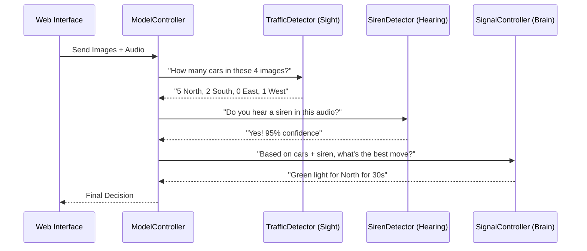

# Chapter 3: Model Orchestrator (ModelController)

In [Chapter 2: Traffic Simulation Environment (TrafficEnv)](02_traffic_simulation_environment__trafficenv__.md), we built a "flight simulator" where our AI can practice managing traffic. But a simulator is just an empty world. To actually make decisions, we need to process camera feeds, listen for sirens, and calculate the best move.

### The Problem: The "Messy Kitchen"
Imagine a restaurant kitchen. You have a person who chops vegetables, a person who grills meat, and a person who plates the food. If they don't talk to each other, the steak will be cold by the time the vegetables are ready. 

In our traffic system, we have:
1. **The Eyes:** A model that sees cars.
2. **The Ears:** A model that hears sirens.
3. **The Brain:** A model that decides which light to turn green.

If we let these models run wildly on their own, the code becomes a "spaghetti mess." The Web UI wouldn't know who to ask for an answer.

### The Solution: The "Head Chef"
The `ModelController` (Model Orchestrator) is the **Head Chef**. It doesn't do the "chopping" or "grilling" itself. Instead, it manages the 5-step pipeline. It takes raw inputs (images and audio) and coordinates the flow of data between specialized AI models. 

By using an Orchestrator, the rest of our app only needs to ask **one** question: *"Here is what the intersection looks like; what should I do?"*

---

### The 5-Step Pipeline

The Orchestrator manages a specific chain of events every few seconds:

1.  **Sight:** Count cars in every lane using computer vision.
2.  **Emergency Check:** Scan for ambulances or fire trucks.
3.  **Hearing:** Listen for siren sounds in the audio.
4.  **Prediction:** Estimate if traffic is about to get worse (using the [Traffic Density Predictor](06_traffic_density_predictor_.md)).
5.  **The Final Decision:** Pass all this data to the [DQN Signal Optimizer (SignalController)](04_dqn_signal_optimizer__signalcontroller__.md) to pick the winner.

---

### How to use the Orchestrator

For a beginner, the beauty of the `ModelController` is that it hides all the complexity. You just give it data, and it gives you a decision.

```python
from control.model_controller import ModelController

# 1. Initialize the "Head Chef"
orchestrator = ModelController()

# 2. Give it the raw data (4 images and 1 audio file)
decision = orchestrator.decide_from_lane_frames(
    lane_frames={"laneN": img1, "laneS": img2, "laneE": img3, "laneW": img4},
    audio_bytes=siren_audio
)
```
**What happens next:** The `decision` variable now contains everything: which lane should be green, for how many seconds, and why (e.g., "Emergency detected!").

---

### Under the Hood: The Orchestration Flow

When you call that single function, the Orchestrator starts a sequence of internal tasks.



#### Step 1: Gathering the "Sight"
Inside `model_controller.py`, the orchestrator loops through the images we provided.

```python
# Simplified internal logic
for lane in ["laneN", "laneS", "laneE", "laneW"]:
    frame = lane_frames.get(lane)
    # Use the TrafficDetector to count cars
    detection = self._traffic_detector.detect(frame)
    lane_counts[lane] = detection["total"]
```
*Explanation: It asks the "Eyes" of the system to look at each camera feed individually and report back a number.*

#### Step 2: The "Emergency Override" logic
This is where the Orchestrator shows its power. It combines sight and hearing to make a "safety" decision.

```python
# Combining Sight + Hearing
emergency_visual = emergency_model.detect(frames)
siren_audio = siren_model.listen(audio)

if emergency_visual and siren_audio:
    # FORCE the green light for the ambulance!
    decision = self.create_emergency_corridor(lane)
```
*Explanation: If it sees an ambulance AND hears a siren, it skips the normal AI logic and triggers the "Green Corridor" immediately.*

---

### Why this matters for the Web Interface
Because the `ModelController` acts as a central hub, our web routes (found in `gui/routes.py`) stay incredibly clean. 

Instead of the web server trying to talk to five different AI models, it just talks to the Orchestrator:

```python
@bp.post("/api/run_cycle")
def run_cycle():
    # The Web UI just passes the data to the Orchestrator
    result = controller.decide_from_lane_frames(
        lane_frames, 
        audio_bytes=audio_bytes
    )
    # And sends the answer back to the user's screen
    return jsonify(result)
```

---

### Summary
In this chapter, we learned that the `ModelController` is the "Manager" of the project.
- It **orchestrates** the flow of data between vision, audio, and decision models.
- It **simplifies** the system so the Web UI only has to talk to one component.
- It **safeguards** the intersection by prioritizing emergency vehicles.

Now that we understand how the data is managed, let's look at the "Brain" that makes the actual timing choices.

**Next Chapter: [Chapter 4: DQN Signal Optimizer (SignalController)](04_dqn_signal_optimizer__signalcontroller__.md)**

---

Generated by [AI Codebase Knowledge Builder](https://github.com/The-Pocket/Tutorial-Codebase-Knowledge)