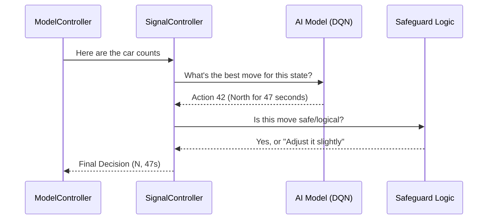

# Chapter 4: DQN Signal Optimizer (SignalController)

In [Chapter 3: Model Orchestrator (ModelController)](03_model_orchestrator__modelcontroller__.md), we learned how the "Head Chef" of our system organizes data from cameras and microphones. Now, it is time to meet the **Brain** of the intersection: the **SignalController**.

### The Problem: The "Dumb" Timer
Most traffic lights use simple timers. For example: "North stays green for 30 seconds, then East stays green for 30 seconds." 

But what if there are **50 cars** waiting North and **0 cars** waiting East? A dumb timer wastes 30 seconds on an empty road while the North lane grows into a massive traffic jam.

### The Solution: The Chess Grandmaster
The `SignalController` acts like a **Chess Grandmaster**. Instead of following a rigid script, it looks at the "board" (the current traffic) and picks the best possible move to win the game (clearing the traffic).

It uses a **DQN (Deep Q-Network)**. This is a type of AI that learns through "rewards." If it clears a lot of cars, it gets a high score. If it lets cars sit for too long, it gets a penalty. Over millions of practices in our [Traffic Simulation Environment (TrafficEnv)](02_traffic_simulation_environment__trafficenv__.md), it learns the perfect timing for every situation.

---

### Key Concept: The 224 Possible Moves
To give the AI total control, we don't just let it pick a color. We let it pick a **Direction** and a **Duration**.

*   **4 Directions:** North, South, East, West.
*   **56 Durations:** Anywhere from 5 seconds to 60 seconds.

If you multiply 4 directions by 56 possible times, you get **224 unique actions**. 
- Action 0 might be: "North for 5 seconds."
- Action 223 might be: "West for 60 seconds."

The AI evaluates all 224 options and picks the one it thinks will result in the highest "Reward."

---

### How to use the SignalController

Using the Brain is very simple. You give it a dictionary of car counts, and it gives you back a decision.

```python
from control.signal_controller import SignalController

# 1. Initialize the Brain
sc = SignalController()

# 2. Tell it how many cars are in each lane
lane_counts = {"laneN": 15, "laneS": 2, "laneE": 0, "laneW": 1}

# 3. Get the winning move
decision = sc.decide(lane_counts)
```
**Output:** The `decision` might look like this: `{"direction": "N", "duration": 22, "mode": "dqn"}`. The AI saw 15 cars North and decided 22 seconds was the perfect amount of time to clear them.

---

### Under the Hood: The Decision Process

When you call `sc.decide()`, the controller goes through a three-step process to ensure the decision is both smart and safe.



#### 1. Converting Reality to "AI Language"
The AI doesn't understand "cars." It understands numbers between 0 and 1. The controller uses the rules set in [Chapter 1: Centralized System Configuration (config.py)](01_centralized_system_configuration__config_py__.md) to scale the counts.

```python
# Internal scaling logic (Simplified)
def make_state(self, counts):
    # If 30 is the max cars, 15 cars becomes 0.5
    normalized_counts = counts / 30.0
    return normalized_counts
```

#### 2. The "Shield" (Safeguards)
Sometimes, even a Grandmaster makes a mistake. We added a "Direction Shield" to prevent the AI from doing something silly, like giving a green light to an empty road when the other road is overflowing.

```python
# If the AI picks an empty lane, override it!
if counts[chosen_lane] < (counts[busiest_lane] * 0.5):
    direction = busiest_lane
    print("Safety Shield: Overriding to busiest lane!")
```

#### 3. Proportional Fallback (The Safety Net)
What if the AI model file is missing or corrupted? The `SignalController` is designed to be "Fail-Safe." If the AI isn't available, it switches to **Proportional Mode**.

```python
# If AI is broken, use math instead
def proportional_decide(self, counts):
    # Give the most time to the lane with the most cars
    direction = busiest_lane
    duration = (counts[direction] / total_cars) * 60
    return direction, duration
```

---

### Learning from Experience (Online Update)
Unlike a static program, this Brain can get smarter while it's working on the street. After a green light ends, we tell the AI how it did. 

```python
# "Hey Brain, you chose North for 20s. 
# You cleared 10 cars and 2 are left. 
# Here is your reward score!"
sc.online_update(old_counts, action, reward, new_counts)
```
This is called **Online Learning**. It allows the system to adapt if traffic patterns change over the years (for example, if a new shopping mall opens nearby).

---

### Summary
In this chapter, we explored the **SignalController**, the intelligence of our system.
- It uses a **DQN AI** to choose from 224 different timing "moves."
- It uses **Safeguards** to ensure the AI never makes an illogical choice.
- It includes a **Fallback Mode** so the traffic light never gets stuck if the AI fails.
- It **Learns** over time to become more efficient.

Now that we have a Brain making smart decisions for everyday traffic, what happens when an ambulance arrives? We need a way to override the Brain for emergencies.

**Next Chapter: [Chapter 5: Emergency Green Corridor Logic](05_emergency_green_corridor_logic_.md)**

---

Generated by [AI Codebase Knowledge Builder](https://github.com/The-Pocket/Tutorial-Codebase-Knowledge)