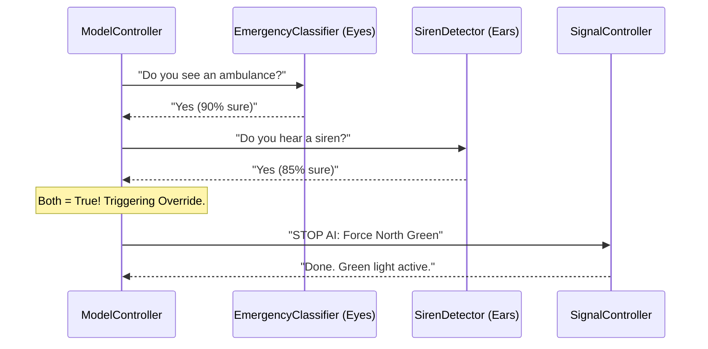

# Chapter 5: Emergency Green Corridor Logic

In [Chapter 4: DQN Signal Optimizer (SignalController)](04_dqn_signal_optimizer__signalcontroller__.md), we met the "Chess Grandmaster" of our system—an AI that makes smart timing decisions for everyday traffic. But even a Grandmaster knows when to step aside. When an ambulance is racing toward an intersection, we don't want the AI to "think"; we want it to **act immediately**.

### The Problem: The "Ambulance Poster" False Alarm
Imagine a bus drives by with a giant advertisement on its side showing a picture of an ambulance. If our system only used its "eyes" (computer vision), it might see that picture, think it’s a real emergency, and stop all traffic for a poster!

On the flip side, if we only used "ears" (microphones), the system might hear a siren from a distant street or a TV show playing in a nearby car and trigger a green light for no reason. 

### The Solution: The "VIP Security Gate"
To solve this, we use **Two-Factor Authentication**. Just like a high-security vault requires both a keycard and a fingerprint, our "Emergency Green Corridor" only opens if two conditions are met at the exact same time:
1.  **The Eyes:** The `EmergencyClassifier` sees a real ambulance.
2.  **The Ears:** The `SirenDetector` hears a real siren.

By requiring both, we create a "Green Corridor"—a prioritized path that overrides the AI to save lives safely.

---

### Key Concepts of the Green Corridor

#### 1. Two-Factor Verification
The system cross-references the camera feed and the audio feed. If the visual confidence is high AND the siren is detected, the "Green Corridor" is activated.

#### 2. The AI Override
Once an emergency is verified, the system ignores the [DQN Signal Optimizer (SignalController)](04_dqn_signal_optimizer__signalcontroller__.md). It stops its "chess game" and forces the specific lane where the ambulance is located to turn green.

#### 3. Safety Buffers & Caps
We can't keep a light green forever, or the rest of the city would hit a permanent gridlock.
- **Duration Cap:** A maximum limit (e.g., 60 seconds) for the emergency green light.
- **Preemption Buffer:** A tiny delay to allow cars currently in the middle of the intersection to clear out before the ambulance zooms through.

---

### How to use the Emergency Logic

The [Model Orchestrator (ModelController)](03_model_orchestrator__modelcontroller__.md) handles this automatically. You just provide the images and audio, and it checks for the emergency "handshake."

```python
# The Orchestrator does the heavy lifting
result = orchestrator.decide_from_lane_frames(
    lane_frames=camera_images, 
    audio_bytes=microphone_audio
)

# If an ambulance is detected:
# result['mode'] will be "emergency-override"
# result['direction'] will be the ambulance's lane
```
**What happens:** The system detects the ambulance, sets the light to green for that lane, and calculates exactly how many extra seconds are needed to get the vehicle through safely.

---

### Under the Hood: The Emergency Handshake

When data flows into the system, here is how the "VIP Gate" decides whether to open:



#### 1. Checking the "Eyes" (EmergencyClassifier)
The system looks for specific "Target IDs" (like an ambulance) and ignores regular cars.

```python
# Inside control/emergency_classifier.py
def is_emergency(self, predictions):
    for p in predictions:
        # Is this an ambulance AND is the AI sure?
        if p['class_id'] in AMBULANCE_IDS and p['conf'] > 0.7:
            return True
    return False
```
*Explanation: This filters out everything except the specific vehicles we want to prioritize.*

#### 2. Checking the "Ears" (SirenDetector)
The system processes audio bytes to find the unique frequency of a siren.

```python
# Inside control/siren_detector.py
def detect(self, audio_bytes):
    # Turn sound into numbers
    signal = self._decode_audio(audio_bytes)
    # Check if the sound matches a siren pattern
    confidence = self.model.predict(signal)
    return confidence > 0.5
```
*Explanation: This ensures that a silent picture of an ambulance won't trigger the system.*

#### 3. Calculating the "Safe Passage" Time
We don't just turn the light green; we calculate how long it needs to stay green based on settings in [Centralized System Configuration (config.py)](01_centralized_system_configuration__config_py__.md).

```python
# Inside control/model_controller.py
# Add a 'buffer' to the normal green time to ensure safety
emergency_duration = min(
    base_duration + cfg.EMERGENCY_DURATION_BUFFER_SEC,
    cfg.EMERGENCY_DURATION_CAP_SEC
)
```
*Explanation: We take the normal green light time and add a "Safety Buffer" (e.g., +10 seconds) to make sure the ambulance isn't cut off mid-intersection.*

---

### Summary
In this chapter, we learned how the **Emergency Green Corridor Logic** protects the city.
- It uses **Two-Factor Authentication** (Vision + Audio) to prevent false alarms.
- It **Overrides** the standard AI to give ambulances an immediate path.
- It uses **Safety Buffers** to ensure the ambulance passes completely before resuming normal traffic.

Now that we can handle both regular traffic and emergencies, how do we prepare for the *future*? In the next chapter, we'll learn how the system predicts traffic jams before they even happen.

**Next Chapter: [Chapter 6: Traffic Density Predictor](06_traffic_density_predictor_.md)**

---

Generated by [AI Codebase Knowledge Builder](https://github.com/The-Pocket/Tutorial-Codebase-Knowledge)