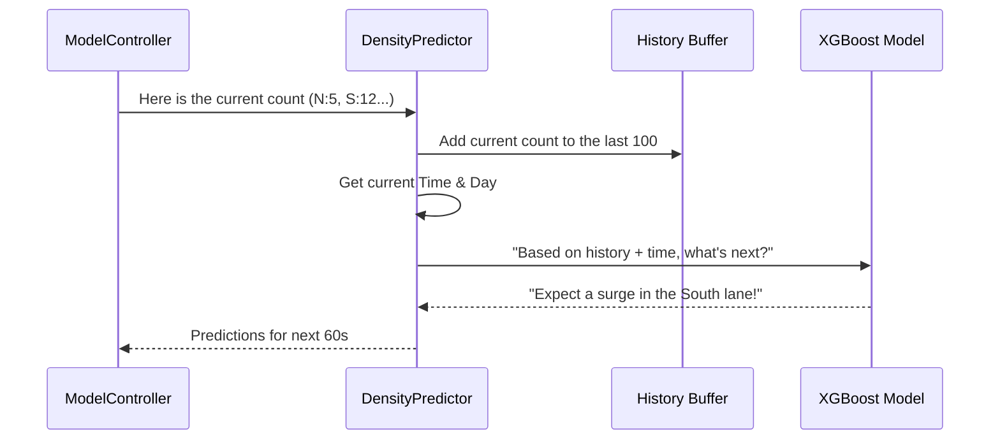

# Chapter 6: Traffic Density Predictor

In [Chapter 5: Emergency Green Corridor Logic](05_emergency_green_corridor_logic_.md), we learned how to handle life-saving emergencies by overriding the AI. But what about the "silent killer" of city efficiency? The everyday traffic jam that builds up because the lights didn't see a rush hour coming.

### The Problem: Reactive vs. Proactive
Most smart traffic lights are **reactive**. They see 20 cars *right now* and turn green. But what if those 20 cars are just the beginning of a 200-car surge from a nearby factory that just finished its shift? 

By the time a reactive system sees the surge, the intersection is already blocked. We don't just need to see the present; we need to predict the future.

### The Solution: The "Traffic Weather Forecaster"
The **Traffic Density Predictor** is our system's crystal ball. While the cameras ([TrafficDetector](03_model_orchestrator__modelcontroller__.md)) tell us what is happening *this second*, the Predictor looks at the history of the last 100 snapshots to guess what the traffic will look like **60 seconds from now**.

It uses a machine learning model called **XGBoost**. Think of XGBoost as a world-class pattern matcher. It knows that "Monday at 8:00 AM" looks different from "Sunday at 11:00 PM," and it uses that knowledge to stay one step ahead of the traffic.

---

### Key Concepts of Density Prediction

To make an accurate guess, the predictor uses three main ingredients:

#### 1. The Sliding Window (The Recent Past)
The system keeps a "memory" of the last 100 times it checked the lanes. This allows it to see **trends**. Are the numbers going up? Are they staying flat? 

#### 2. Temporal Features (The Clock and Calendar)
Traffic follows a rhythm. To help the AI understand this, we give it the **Time of Day** and the **Day of the Week**. This helps it "remember" rush hour patterns.

#### 3. The Horizon (The Near Future)
We don't try to predict traffic next week. We focus on a **60-second horizon**. This is the "sweet spot" that gives the [SignalController](04_dqn_signal_optimizer__signalcontroller__.md) enough time to adjust the lights before the wave of cars actually hits.

---

### How to use the Predictor

The predictor is managed by the `ModelController`. Every time the system runs a cycle, it automatically updates its memory and generates a forecast.

```python
from control.density_predictor import DensityPredictor

# 1. Initialize the Forecaster
predictor = DensityPredictor()

# 2. Give it the current car counts (it adds this to its 100-snapshot memory)
lane_counts = {"laneN": 5, "laneS": 12, "laneE": 2, "laneW": 8}
forecast = predictor.predict(lane_counts)

# 3. See the future!
print(forecast["predictions"]) 
```
**Output:** `{'N': 7.2, 'S': 18.5, 'E': 2.1, 'W': 9.0}`. Even though there are 12 cars South now, the AI predicts there will be 18.5 cars very soon!

---

### Under the Hood: The Prediction Pipeline

When you call `predict()`, the system goes through a quick 3-step process:



#### Step 1: Managing the Memory
Inside `control/density_predictor.py`, we use a `deque` (a special list) that automatically kicks out the oldest snapshot when a new one arrives.

```python
# A deque with a maxlen of 100 keeps only the latest data
self._history = deque(maxlen=100)

def update_history(self, lane_counts):
    # Convert lane data to direction data (N, S, E, W)
    counts = lane_counts_to_direction_counts(lane_counts)
    self._history.append(counts)
```
*Explanation: This ensures the "Sliding Window" always contains exactly the last 100 moments of traffic.*

#### Step 2: Understanding "Circular Time"
Computers get confused by time. 11:59 PM (23:59) and 12:01 AM (00:01) look like they are far apart numerically, but they are actually right next to each other! We use math (Sine and Cosine) to turn time into a circle so the AI understands that midnight is close to 11 PM.

```python
# Simplified look at how we process time
now = datetime.now()
hour_val = now.hour + now.minute / 60.0

# Convert hour to a "Circular" coordinate
time_feature_sin = np.sin(2 * np.pi * hour_val / 24.0)
time_feature_cos = np.cos(2 * np.pi * hour_val / 24.0)
```
*Explanation: This helps the AI recognize that traffic patterns at 11:50 PM and 12:10 AM should be very similar.*

#### Step 3: The XGBoost Forecast
Finally, the system feeds the 100 snapshots and the circular time features into the XGBoost model.

```python
# Run the math model for each direction
for direction in ("N", "S", "E", "W"):
    model = self._models[direction]
    # Predict the number of cars 60 seconds away
    prediction = model.predict(input_data)
    results[direction] = prediction
```
*Explanation: We actually run four mini-predictions—one for each direction—to get the most accurate local forecast.*

---

### Why this matters
By knowing a surge is coming, the [ModelController](03_model_orchestrator__modelcontroller__.md) can tell the [SignalController](04_dqn_signal_optimizer__signalcontroller__.md) to extend a green light *now* to clear the path before the heavy traffic arrives. This prevents the "standing wave" effect that causes gridlock.

### Summary
In this chapter, we learned about the **Traffic Density Predictor**:
- It acts as a **forecaster**, not just a detector.
- It uses a **Sliding Window** of 100 snapshots to see trends.
- It uses **Temporal Features** to understand time-based patterns (like rush hour).
- It uses **XGBoost** to predict traffic density 60 seconds into the future.

But what if the AI becomes *too* efficient? What if it keeps the main road green forever because it's always busy, leaving a single car on the side road waiting for 10 minutes? In the next chapter, we'll learn how to keep the system "fair."

**Next Chapter: [Chapter 7: Fairness and Anti-Starvation Policy](07_fairness_and_anti_starvation_policy_.md)**

---

Generated by [AI Codebase Knowledge Builder](https://github.com/The-Pocket/Tutorial-Codebase-Knowledge)