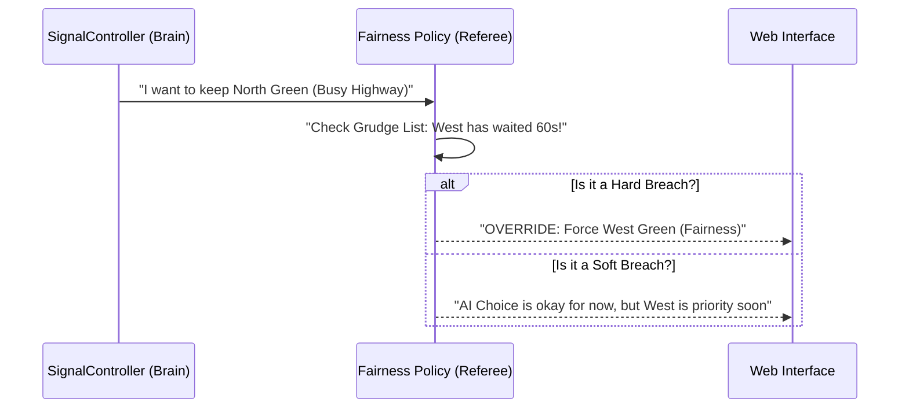

# Chapter 7: Fairness and Anti-Starvation Policy

In [Chapter 6: Traffic Density Predictor](06_traffic_density_predictor_.md), we learned how to look into the future to prevent traffic jams. But there is a hidden danger to being *too* efficient. If an AI is only programmed to "keep the most cars moving," it might become "greedy" and ignore the little guy.

### The Problem: The "Infinite Wait"
Imagine you are driving home late at night on a quiet side street. You pull up to a red light. On the main highway crossing your path, there is a steady stream of trucks. 

Because our [SignalController](04_dqn_signal_optimizer__signalcontroller__.md) wants the highest "reward" (clearing the most cars), it sees 50 trucks on the highway and only 1 car (you) on the side street. The AI decides: *"It's more efficient to keep the highway green forever!"* 

You sit there for 5, 10, 15 minutes. This is called **Starvation**. In the world of AI, efficiency is great, but in the world of humans, **fairness** is a requirement.

### The Solution: The "Fair Play Referee"
The **Fairness and Anti-Starvation Policy** acts as the system's referee. It doesn't care about "AI scores" or "efficiency." It only cares about one thing: **Has everyone had a turn lately?**

It works by keeping a "grudge list" for every lane. If a lane is ignored for too long, the referee blows the whistle and forces the light to change, even if the AI thinks it's a "bad" move for efficiency.

---

### Key Concepts of Fairness

To keep the intersection fair, the system tracks two specific numbers for every lane:

#### 1. Wait Seconds
This is a stopwatch that starts the moment a car is detected in a red-light lane. If the lane stays red, the clock keeps ticking. 

#### 2. Missed Turns
This counts how many times the system started a new green light cycle but *didn't* pick this specific lane. If three other lanes have gone green and you are still waiting, you have "missed" 3 turns.

#### 3. Soft vs. Hard Overrides
- **Soft Override:** The referee says, *"Hey AI, this lane is getting annoyed. I'm going to add some 'bonus points' to this lane's priority to help it win the next choice."*
- **Hard Override:** The referee says, *"That's enough! This lane has waited 2 minutes. I am taking control and turning it green NOW."*

---

### How the Policy Tracks Fairness

This logic lives inside the [Model Orchestrator (ModelController)](03_model_orchestrator__modelcontroller__.md). It maintains a small memory of how frustrated each lane is.

```python
# A look at how the 'grudge list' is stored
self._fairness_state = {
    "laneN": {"wait_seconds": 0.0, "missed_turns": 0},
    "laneS": {"wait_seconds": 15.0, "missed_turns": 1},
    "laneE": {"wait_seconds": 0.0, "missed_turns": 0},
    "laneW": {"wait_seconds": 45.0, "missed_turns": 3},
}
```
*Explanation: In this example, the West lane is very frustrated! It has waited 45 seconds and missed 3 turns.*

---

### Under the Hood: The Referee's Logic

Every time the system makes a decision, it passes the AI's choice through the Fairness Policy.



#### Step 1: Updating the "Grudge List"
Every few seconds, the system updates the clocks. If a lane is currently green, its clocks reset to zero. If it's red and cars are waiting, the numbers go up.

```python
# Simplified update logic in model_controller.py
for lane in LANE_KEYS:
    if lane == served_lane:
        self._fairness_state[lane]["wait_seconds"] = 0
    elif cars_waiting_in_lane:
        # Add 3 seconds to the wait time
        self._fairness_state[lane]["wait_seconds"] += 3
```
*Explanation: This ensures that as soon as you get your green light, the "referee" stops worrying about you.*

#### Step 2: The Hard Override
If a lane hits a "Breach," the policy intercepts the decision.

```python
# If someone waited too long, ignore the AI
wait_threshold = 30.0 # From config.py
if lane_wait > wait_threshold:
    # Change the decision to this lane!
    decision["direction"] = frustrated_lane
    decision["mode"] = "fairness-hard-override"
```
*Explanation: The system checks the `FAIRNESS_WAIT_THRESHOLD_SEC` from your [Centralized System Configuration (config.py)](01_centralized_system_configuration__config_py__.md) to decide when to step in.*

#### Step 3: The Soft Override (The "Nudge")
In "Soft" mode, we don't force a change. Instead, we calculate a "Fairness Score" and add it to the car count.

```python
# Soft score = (Car Count) + (Wait Time * 0.35)
soft_score = current_cars + (wait_seconds * 0.35)

if soft_score > baseline_ai_score:
    # The frustrated lane wins because of its 'bonus' points
    decision["mode"] = "fairness-soft-override"
```
*Explanation: This is like a "tie-breaker." If two roads are equally busy, the one that has been waiting longer wins.*

---

### Why this is Human-Centric AI
Without this policy, a perfectly "efficient" AI would be a nightmare for people living on side streets. By adding a Fairness Policy, we ensure the system follows a basic human rule: **Wait your turn, but don't wait forever.**

### Summary
In this chapter, we learned about the **Fairness and Anti-Starvation Policy**:
- It prevents the AI from being too **"greedy"** with green lights.
- It tracks **Wait Seconds** and **Missed Turns** for every lane.
- It uses **Hard Overrides** to force a light change when thresholds are met.
- It uses **Soft Overrides** to give waiting drivers a "priority boost."

We now have a system that is smart, handles emergencies, predicts the future, and is fair to everyone. But there is one final piece of the puzzle. How do we prevent the AI from "flickering" the lights back and forth too quickly?

**Next Chapter: [Chapter 8: Predictive Stability Guard](08_predictive_stability_guard_.md)**

---

Generated by [AI Codebase Knowledge Builder](https://github.com/The-Pocket/Tutorial-Codebase-Knowledge)