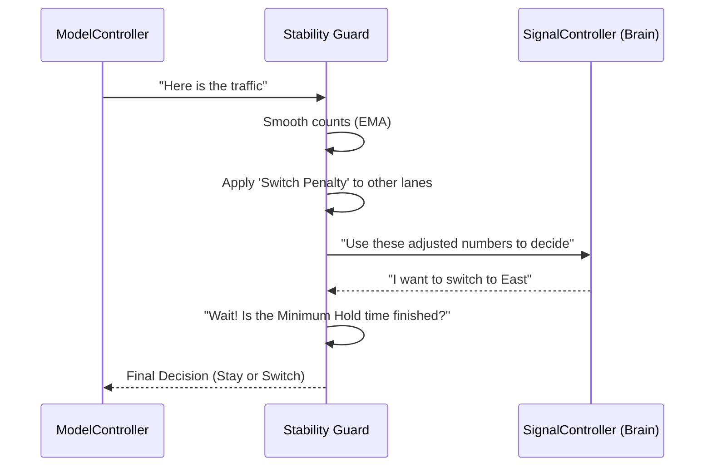

# Chapter 8: Predictive Stability Guard

In [Chapter 7: Fairness and Anti-Starvation Policy](07_fairness_and_anti_starvation_policy_.md), we learned how to be "fair" by ensuring no lane waits forever. But there is one final problem: an AI can sometimes be *too* indecisive. It might want to change the light every two seconds because the car counts shifted slightly.

### The Problem: The "Flickering" Light
Imagine you are driving toward a green light. Suddenly, it turns yellow, then red. Two seconds later, it turns green again. You would be frustrated and confused! 

This happens because the AI is constantly "calculating." If Lane A has 10 cars and Lane B has 11, the AI picks Lane B. A second later, if Lane A gets one more car, the AI might try to switch back immediately. This "flickering" or "jitter" makes traffic move slower and increases the risk of accidents.

### The Solution: The "Steady Hand"
The **Predictive Stability Guard** acts like a steady hand on the steering wheel. It prevents the system from making jumpy, nervous decisions. It ensures that when the [SignalController](04_dqn_signal_optimizer__signalcontroller__.md) decides to change a light, it does so because there is a **significant** benefit, not just a tiny one.

It uses three main tools to keep the intersection calm:
1.  **Smoothing (EMA):** Ignoring tiny, one-second "blips" in traffic.
2.  **The Switch Penalty:** Making it "expensive" for the AI to change its mind.
3.  **The Minimum Hold:** Forcing the light to stay green for a few moments before even considering a change.

---

### Key Concept 1: Exponential Moving Averages (EMA)
Instead of looking only at the *current* car count, the system looks at a "smoothed" average. 

Think of it like checking the temperature. If you open the oven for one second, a thermometer might jump up 100 degrees, but the room isn't actually that much hotter. EMA helps the AI see the "room temperature" of the traffic, ignoring the "oven blast" of a single car passing by.

### Key Concept 2: The Switch Penalty
In our system, we subtract "points" from any lane that isn't currently green. 

**Example:**
*   **Current Green Lane (North):** 10 cars.
*   **Side Lane (East):** 11 cars.
*   **The Penalty:** -2 points for switching.

Even though East has more cars (11 vs 10), the AI sees East as having **9 points** (11 minus 2). Since 10 is bigger than 9, the light stays North. The AI will only switch if East becomes *much* busier (e.g., 13 cars).

---

### How the Stability Guard Works

This logic is built into the [Model Orchestrator (ModelController)](03_model_orchestrator__modelcontroller__.md). It processes the raw data before the AI ever sees it.

```python
# How the system smooths the data (Simplified)
# ema_alpha is the 'smoothness' setting from config.py
new_ema = (alpha * current_count) + (1 - alpha) * last_ema
```
*Explanation: This formula mixes a bit of the "new" data with the "old" data to create a smooth trend line.*

---

### Under the Hood: The Decision Flow

When the system asks "What lane should be green?", the Stability Guard checks the "Steady Hand" rules.



#### Step 1: Smoothing the History
Inside `control/model_controller.py`, the system maintains a memory of the "smoothed" counts for every lane.

```python
# Updating the memory
prev_ema = self._predictive_ema_counts[lane]
# Mix 35% new data with 65% old data
smoothed = (0.35 * current) + (0.65 * prev_ema)
self._predictive_ema_counts[lane] = smoothed
```
*Explanation: By weighing the past heavily, a sudden "ghost car" or a camera glitch won't trick the AI into changing the light.*

#### Step 2: Applying the Penalty
The system makes the "other" lanes look less attractive to prevent unnecessary switching.

```python
# If this lane isn't the one currently green...
if lane != self._predictive_last_selected_lane:
    # Subtract the penalty from config.py
    score = score - cfg.PREDICTIVE_SWITCH_PENALTY
```
*Explanation: This forces the AI to be "sure" that switching is worth the effort.*

#### Step 3: Enforcing the "Minimum Hold"
Even if the AI *really* wants to switch, we check the "Hold Clock" first.

```python
# Check if we have stayed green long enough
if self._predictive_hold_cycles < cfg.PREDICTIVE_MIN_HOLD_CYCLES:
    # FORCE the AI to stay on the current lane
    decision = last_lane_decision
    print("Stability Guard: Holding green for safety.")
```
*Explanation: This ensures the light doesn't "flicker" by staying on the current choice for at least a few cycles.*

---

### Why this is Important
A traffic light that changes too often is dangerous. By using the **Predictive Stability Guard**, we make the AI behave more like a human traffic cop—predictable, calm, and decisive. It ensures that the "efficiency" we gained in [Chapter 4: DQN Signal Optimizer](04_dqn_signal_optimizer__signalcontroller__.md) doesn't come at the cost of driver safety.

### Summary
In this chapter, we learned about the **Predictive Stability Guard**:
- It acts as a **"Steady Hand"** to prevent rapid signal changes.
- It uses **EMA** to smooth out jumpy traffic data.
- It uses a **Switch Penalty** so the AI only changes lanes for a big benefit.
- It enforces a **Minimum Hold** time so drivers aren't confused by flickering lights.

**Congratulations!** You have completed the core chapters of the Adaptive Traffic Signal tutorial. You now understand how to build a system that is:
1.  **Configurable** ([Chapter 1](01_centralized_system_configuration__config_py__.md))
2.  **Simulated** ([Chapter 2](02_traffic_simulation_environment__trafficenv__.md))
3.  **Orchestrated** ([Chapter 3](03_model_orchestrator__modelcontroller__.md))
4.  **Intelligent** ([Chapter 4](04_dqn_signal_optimizer__signalcontroller__.md))
5.  **Safe for Emergencies** ([Chapter 5](05_emergency_green_corridor_logic_.md))
6.  **Predictive** ([Chapter 6](06_traffic_density_predictor_.md))
7.  **Fair** ([Chapter 7](07_fairness_and_anti_starvation_policy_.md))
8.  **Stable** (This Chapter!)

You are now ready to run the project and see these components work together in the real-time dashboard!

---

Generated by [AI Codebase Knowledge Builder](https://github.com/The-Pocket/Tutorial-Codebase-Knowledge)