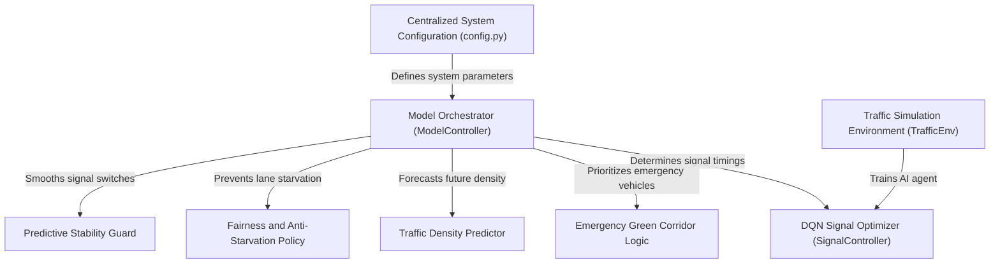

# Tutorial: adaptive-traffic-signal-green-corridor

This project implements an **AI-powered traffic management system** designed to optimize intersection flow and safety. Using a **Deep Q-Network (DQN)**, the system dynamically adjusts signal timings based on real-time vehicle counts, while a **Traffic Density Predictor** forecasts upcoming surges. It features a specialized **Emergency Green Corridor** that uses *computer vision* and *audio siren detection* to prioritize ambulances, all while governed by **Fairness** and **Stability** policies to ensure smooth, equitable transit for all drivers.

**Source Repository:** [None](None)

## Chapters

1. [Centralized System Configuration (config.py)
](01_centralized_system_configuration__config_py__.md)
2. [Traffic Simulation Environment (TrafficEnv)
](02_traffic_simulation_environment__trafficenv__.md)
3. [Model Orchestrator (ModelController)
](03_model_orchestrator__modelcontroller__.md)
4. [DQN Signal Optimizer (SignalController)
](04_dqn_signal_optimizer__signalcontroller__.md)
5. [Emergency Green Corridor Logic
](05_emergency_green_corridor_logic_.md)
6. [Traffic Density Predictor
](06_traffic_density_predictor_.md)
7. [Fairness and Anti-Starvation Policy
](07_fairness_and_anti_starvation_policy_.md)
8. [Predictive Stability Guard
](08_predictive_stability_guard_.md)

---

Generated by [AI Codebase Knowledge Builder](https://github.com/The-Pocket/Tutorial-Codebase-Knowledge)